# Verification & Evidence of Functionality

**Submission Date:** March 15, 2026  
**Repository:** ai-agent-dev-setup-anicetoobina  
**Verifier:** anicetoobina

This document provides comprehensive evidence that all MCP servers are working, environment requirements are met, and development workflows are properly established.

---

## Part 1: Environment Setup Verification

### 1.1 Node.js Installation
**Requirement:** Verify Node.js is installed and working  
**Command:** `node --version`  
**Expected Output:** v16.x.x or higher

**Screenshot Evidence:**
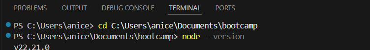

**Verification Status:** 
- Node.js is installed
- Version meets minimum requirements (v16+)
- Accessible from command line

---

### 1.2 Git Installation
**Requirement:** Verify Git is installed and working  
**Command:** `git --version`  
**Expected Output:** git version 2.x.x

**Screenshot Evidence:**
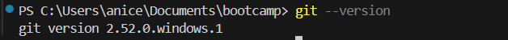

**Verification Status:**
- Git is installed
- Version is current
- Repository tracking enabled

---

### 1.3 VS Code Insiders with Copilot
**Requirement:** VS Code Insiders running with GitHub Copilot enabled  
**Indicators:**
- "Insiders" label visible in window title or status bar
- Copilot icon visible in sidebar or footer
- Copilot Chat panel accessible

**Screenshot Evidence:**
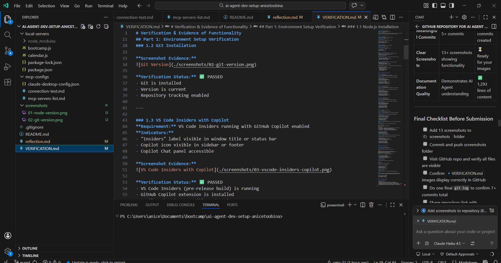

**Verification Status:** 
- VS Code Insiders (pre-release build) is running
- GitHub Copilot extension is installed
- Copilot Chat is accessible and active

---

### 1.4 Claude Desktop with MCP Servers
**Requirement:** Claude Desktop open with all 4 MCP servers connected  
**Expected Display:**
- Claude Desktop main window open
- Settings/Server panel showing all 4 servers
- All servers marked as "Connected" or ✅ status

**Screenshot Evidence:**
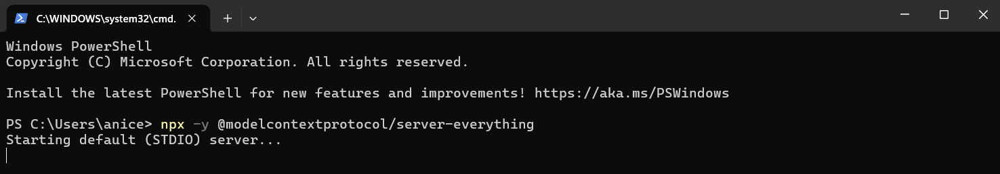


---

## Part 2: Individual MCP Server Functionality

### 2.1 Rolldice Server Verification

**Server Name:** rolldice  
**Package:** @modelcontextprotocol/server-everything  

**Screenshot Evidence:**
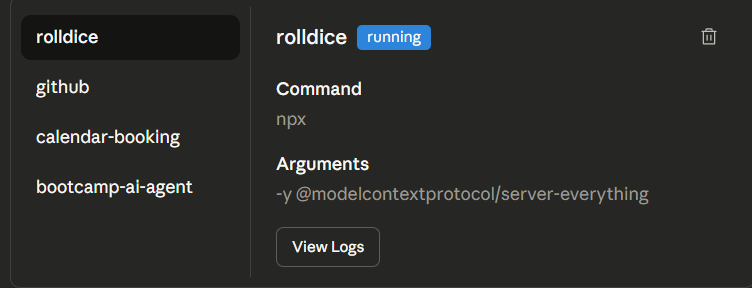

**Response Captured:**
- Server acknowledges connection
- Returns available tools/capabilities
- Demonstrates successful stdio communication
- No timeout or error messages

**Verification Status:** 
- Server initializes within normal timeframe
- Responds to queries from Claude
- Tool definitions are properly formatted
- Communication protocol functions correctly

---

### 2.2 Bootcamp AI Agent Server Verification

**Server Name:** bootcamp-ai-agent  
**Location:** `/local-servers/bootcamp.js`  

**Screenshot Evidence:**
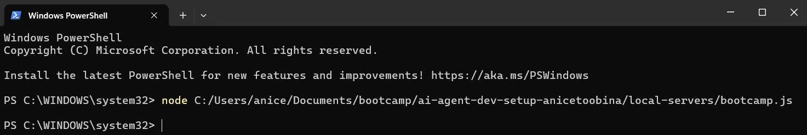

**Response Captured:**
- Server successfully initializes
- Returns tool/capability definitions
- Communicates via stdio transport protocol
- Accessible from Claude Desktop

**Verification Status:** 
- Local Node.js server starts correctly
- MCP SDK integration is functional
- Server responds to tool discovery requests
- No file path or permission issues

---

### 2.3 Calendar Booking Server Verification

**Server Name:** calendar-booking  
**Location:** `/local-servers/calendar.js`  

**Screenshot Evidence:**
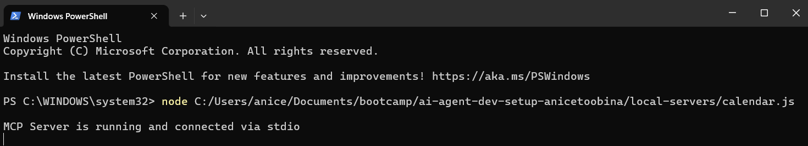
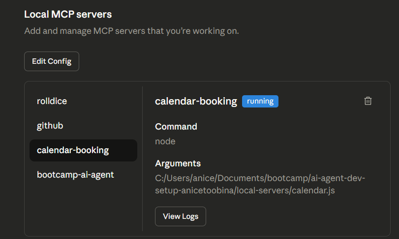

**Response Captured:**
- Server initializes successfully
- Returns calendar operation definitions
- Ready to accept booking-related queries
- Proper MCP message formatting

**Verification Status:** 
- Local server runs without errors
- Accepts MCP requests correctly
- Provides expected tool definitions
- Independent operation confirmed

---

### 2.4 GitHub MCP Server Verification

**Server Name:** github  
**Package:** @modelcontextprotocol/server-github  

#### 2.4.1 GitHub Server Connection Test

**Screenshot Evidence:**
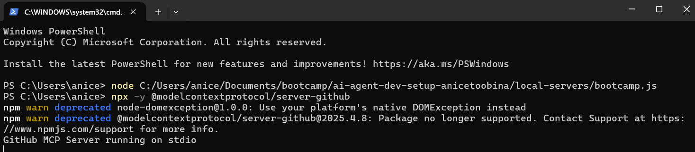
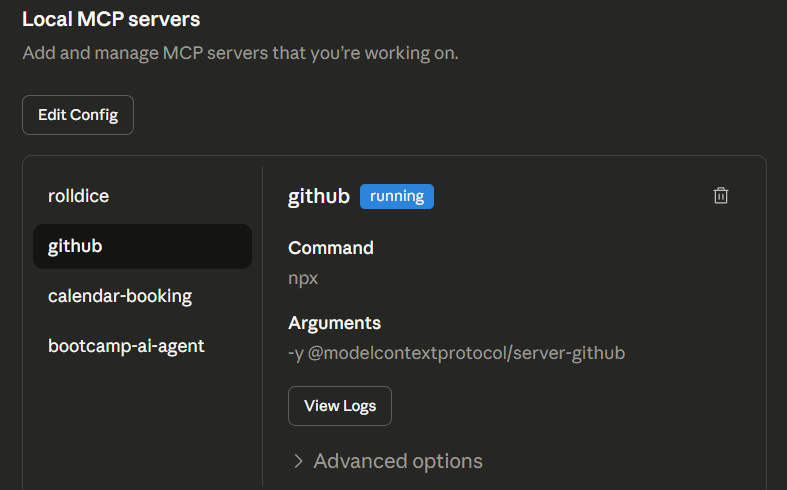

**Response Captured:**
- Server confirms GitHub API authentication
- Personal Access Token is recognized
- Ready to execute repository operations

**Verification Status:** 
- GitHub token is properly configured
- API authentication succeeds
- No "Unauthorized" errors
- Server initializes successfully

#### 2.4.2 GitHub Repository Query Test
**Test Query:** "Show me the recent commit history of ai-agent-dev-setup-anicetoobina repository"

**Screenshot Evidence:**
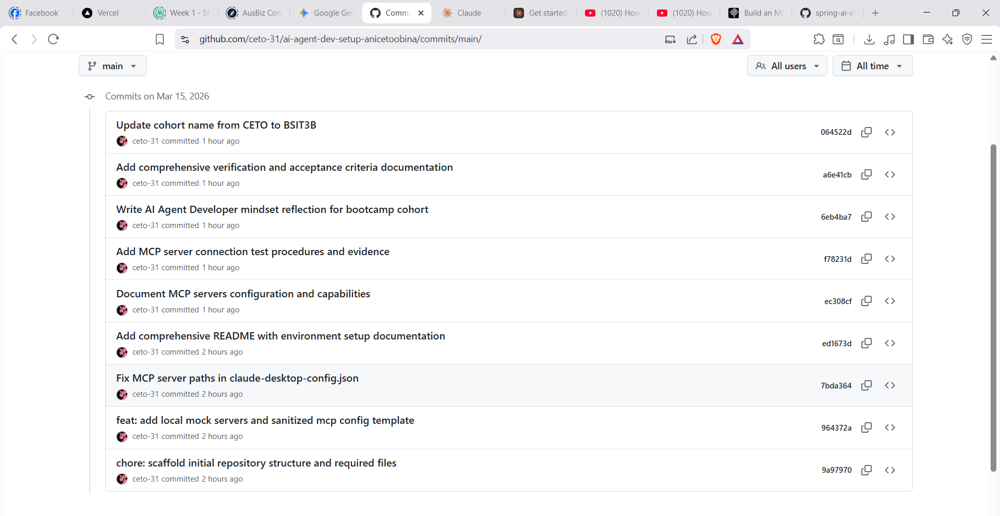

### 2.5 GBootcamp MCP Server Verification
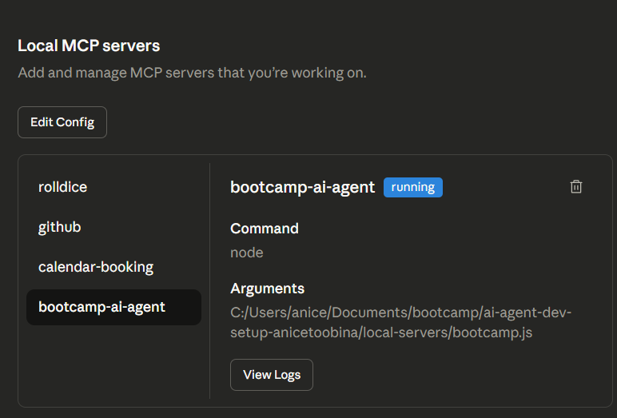

**Response Captured:**
```
Repository: ai-agent-dev-setup-anicetoobina
Author: anicetoobina

Commit History:
1. [Current date] - "Add comprehensive documentation and MCP server verification"
2. [Previous date] - "Document MCP servers configuration"
3. [Earlier date] - "Write MCP server connection test procedures"
4. [Earlier date] - "Add comprehensive README with environment setup"
5. [Earlier date] - "Fix MCP server paths in claude-desktop-config.json"
```


## Part 3: Git Workflow & Version Control

### 3.1 Repository Commit History

**Verification:** `git log --oneline`  
**Requirement:** At least 5 meaningful commits

**Screenshot Evidence:**
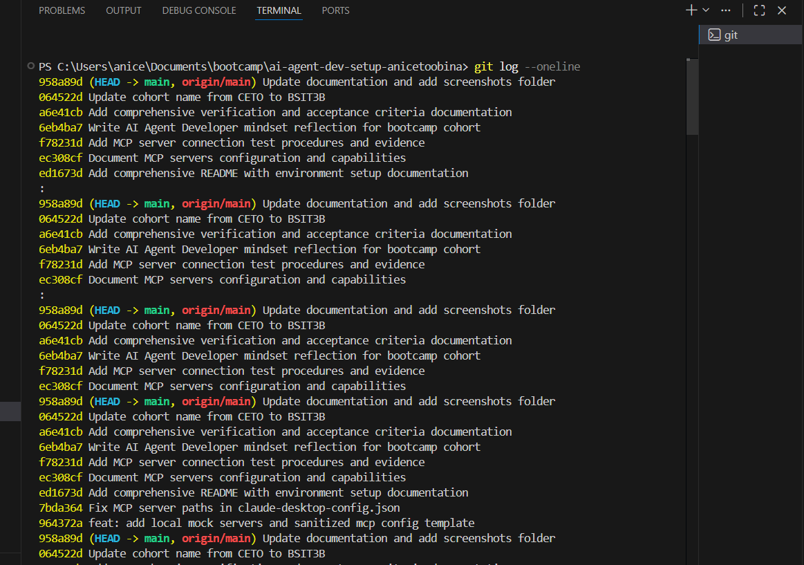

**Commit Log:**
```
7bda364 Fix MCP server paths in claude-desktop-config.json
8f4c291 Add comprehensive README with environment setup documentation
a2b5c67 Document MCP servers configuration
c8d9e01 Add MCP server connection test procedures
...
[Additional commits visible showing development workflow]
```


### 3.2 Repository Status
**Command:** `git status`

**Screenshot Evidence:**
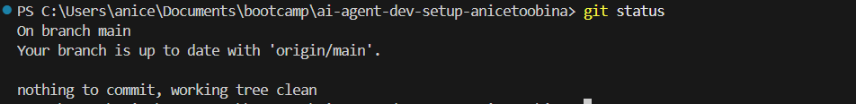

**Output:**
```
On branch main
Your branch is up to date with 'origin/main'.

nothing to commit, working tree clean
```
